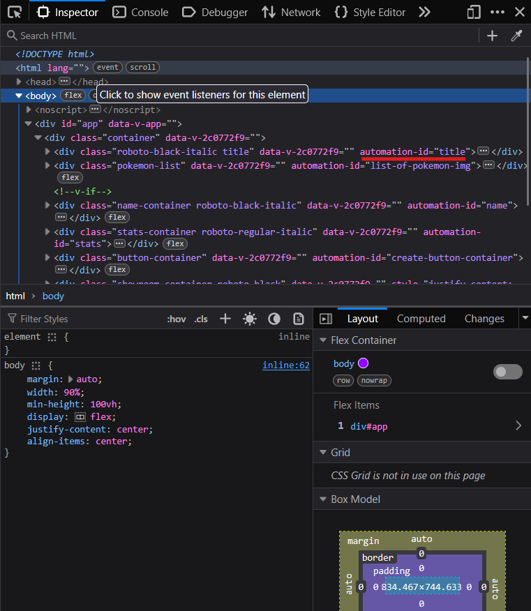

## Video 1

### Comencemos con los Tests

Si corremos la aplicación y nos dirigimos a http://localhost:8080 y abrimos la consola de inspección, con boton derecho sobre la pagina y vamos a inspect o inspeccionar dependiendo 


Con nuestro primer script navegamos al buscador y checkeamos que el titulo que en el titulo se encuentre la palabra "Pokemon" y que se encuentre el texto "Creador de cartas Pokemon".



```python
def test_has_title(page: Page):
    
    page.goto("http://localhost:8080")

    # Con expect verificamos que se cumpla una condición de que el titulo posee la palabra "Pokemon"
    expect(page).to_have_title(re.compile("^Pokemon"))

def test_has_h1_title(page: Page):

    page.goto("http://localhost:8080")

    # Derificamos que se encuentre en un h1 el texto "Creador de cartas Pokemon"
    expect(page.locator("//div[contains(@class, \"title\")]/h1")).to_have_text("Creador de cartas Pokemon")
    # expect(page.get_by_role("heading", name="Creador de cartas Pokemon")).to_be_visible()
```

Bien veamos otros dos test mas creando un E2E de la pagina para la creación, y borrado de tarjetas.

#### Crear tarjeta Pokemon

```python
def test_create_card(page: Page):

    # Nos dirigimos a la pagina web
    page.goto("http://localhost:8080")

    # Seleccionamos un pokemon
    page.get_by_alt_text("bulbasaur").click()

    # Ingresamos un nombre al pokemon
    page.get_by_role("textbox", name="Nombre *").fill("Playwright")

    # Ingresamos el valor de la vida
    page.get_by_role("spinbutton", name="Vida 1-100 *").fill("100")
    
    # Ingresamos el valor de la velocidad
    page.get_by_role("spinbutton", name="Velocidad 1-100 *").fill("50")
    
    # Ingresamos el valor del ataque
    page.get_by_role("spinbutton", name="Ataque 1-100 *").fill("60")
    
    # Ingresamos el valor de la defensa
    page.get_by_role("spinbutton", name="Defensa 1-100 *").fill("10")

    # Presionamos el boton crear Pokemon
    page.get_by_role("button", name="Crear Pokemon").click()

    # Verificamos que se haya creado la carta
    expect(page.get_by_alt_text("Playwright")).to_be_visible()
```

#### Borrar tarjeta Pokemon

```python
def test_delete_card(page: Page):
    
    # Corremos la generación de la carta
    test_create_card(page)

    # Ubicamos la carta y presionamos el boton borrar
    page.locator("//div[contains(@class, \"card\")]/div[@class=\"name\"]/h3[text()=\"Playwright\"]/parent::div/parent::div/div/button").click()

    # Verificamos que no se encuentre mas la carta
    expect(page.get_by_alt_text("Playwright")).not_to_be_visible()
```

## Video 2

### Usando Fixtures con pytest

Que es un fixture? 

Es una funcionalidad que nos permite darle un contexto a la función que se va a ejecutar en este caso el test.

Creamos un archivo fixtures.py dentro de la carpeta tests

> El archivo podria ser creado en cualquier otra carpeta, por practicidad lo creo dentro del mismo directorio

```python
import pytest

from playwright.sync_api import Page

@pytest.fixture(scope="function", autouse=True)
def before_each_after_each(page: Page):

    # Vamos a la pagina del buscador
    page.goto("http://localhost:8080")

    yield
```

Para que esto funcione al correr nuestros tests debemos dirigirnos al archivo que contiene los tests e importarlo pero antes de esto hay que crear el archivo __init__.py para que el entorno de python entienda que debe tratar la carpeta como un modulo y nos permita importar el archivo solo nos resta agregar el siguiente codigo a nuestro archivo de tests

```python
from .fixtures import before_each_after_each
```

y resta comentar o eliminar las lineas de page.goto a cada test

En este codigo podemos ver como utilizando un fixture se pudo generalizar el codigo para ir a la pagina web.

Esta forma de pensar los fixture es el paradigma que plantea pytest si desean ver una forma de manejar el estilo que se maneja desde hace años pueden ver la [documentación de pytest](https://docs.pytest.org/en/stable/how-to/xunit_setup.html)

Ahora vamos a modificar nuestro fixture before_each_after_each para crear un entorno personalizado.

Primero ordenemos el proyecto para que los fixtures se encuentren mas ordenado

Creemos un directorio con el nombre de test_fixtures para contener los archivos y dentro creemos __init__.py para que sea interpretado como modulo.

Ahora movemos el archivo fixtures.py y lo renombramos con el nombre context_for_tests.py

Ahora veremos otra metodologia; modificamos el metodo para que cree un contexto nuevo donde cambiaremos el atributo utilizado por defecto por el metodo get_by_test_id "data-testid" por "automation-id" con esto habilitaremos porder encontrar elementos con este metodo.

```python
# context_for_tests.py

import pytest

from playwright.sync_api import Playwright

@pytest.fixture(scope="function")
def pokemon_config(playwright: Playwright):
    playwright.selectors.set_test_id_attribute("automation-id")
    browser = playwright.chromium.launch()
    context = browser.new_context()
    page = context.new_page()
    
    # Vamos a la pagina del buscador
    page.goto("http://localhost:8080")

    return page
```

Como vemos cambie el nombre del metodo para que sea mas especifico de lo que hace.
Este recibe un objeto Playwright ejecutando el fixture playwright, configuramos el automation-id y dejamos intacto goto y retornamos el objeto Page

Por ese motivo lo que vamos a hacer luego es cambiar la ejecución del fixture page por pokemon_config.

Esta ultima metodologia nos permite crear test y ejecutarlos con diferentes contextos, es util si queremos tener tests que ejecuten en ciertos entornos como por ejemplo uno movil y uno web, otro podria ser el testing de API's

## Video 3

### POM (Page Object Model)

Veamos este metodo de programar los tests, lo que plantea Page Object Model es que cada pagina se convierte en un objeto donde sus propiedades contienen los localizadores (locators) y los metodos contienen codigo que procesa varia información de la pagina o devulve un localizador que es dinamico ya que cambia segun la información que obtiene la pagina de alguna API o la interacción del usuario.

Por lo que crearemos el codigo de la pagina en una clase y luego instanciaremos la misma dentro de los tests.

> NOTA
> 
> No es necesario crear todos los localizadores en una primera etapa lo recomendable es ir agregandolos en la medida que sean necesarios.

Comencemos por separar las clases de la carpeta tests.

Creamos el directorio page_objects y dentro creamos dos archivos:

**__init__.py** -- Este lo dejamos vacio, su utilidad es que python interprete que el directorio tiene que ser interpretado como modulo, para nosotros poder importar las clases.

**card_manager_page.py** -- Donde pondremos el codigo de nuestra clase


```python
# card_manager_page.py

import random

from playwright.sync_api import Page
from playwright.sync_api import Locator

class CardManager:

    def __init__(self, page: Page):
        self._page = page
        self.title_heading = page.get_by_role("heading", name="Creador de cartas Pokemon")
        self.name_input = page.get_by_role("textbox", name="Nombre *")
        self.life_input = page.get_by_role("spinbutton", name="Vida 1-100 *")
        self.speed_input = page.get_by_role("spinbutton", name="Velocidad 1-100 *")
        self.atack_input = page.get_by_role("spinbutton", name="Ataque 1-100 *")
        self.defense_input = page.get_by_role("spinbutton", name="Defensa 1-100 *")
        self.create_card = page.get_by_role("button", name="Crear Pokemon")

    
    def select_pokemon(self):
        """
            Encuentra las imagenes de pokemon que se encuentran disponible y selecciona una al azar
        """
        pokemons = [
            pokemon.get_attribute("alt") 
            for pokemon in self._page.get_by_test_id("list-of-pokemon-img").get_by_role("img").all()
            ]
        self._page.get_by_role("img", name=pokemons[random.randint(0, len(pokemons) - 1)]).click()
    
    def card_created(self, name: str) -> Locator:
        return self._page.get_by_alt_text(name)

    def card_created_delete(self, name: str):
        self._page.locator(f"//div[contains(@class, \"card\")]/div[@class=\"name\"]/h3[text()=\"{name}\"]/parent::div/parent::div/div/button").click()

```

Ahora vamos a nuestro archivo con los tests y lo modificamos para hacer uso de la clase CardManager

```python
# test_end_to_end.py

import re

from playwright.sync_api import Page
from playwright.sync_api import expect
from ..test_fixtures.context_for_tests import pokemon_config
from ..page_objects.card_manager_page import CardManager


def test_has_h1_title(pokemon_config: Page):
    
    # Inicializamos CardManager
    card_manager = CardManager(pokemon_config)

    # Derificamos que se encuentre en un h1 el texto "Creador de cartas Pokemon"
    expect(card_manager.title_heading).to_have_text("Creador de cartas Pokemon")
    # expect(page.get_by_role("heading", name="Creador de cartas Pokemon")).to_be_visible()

def test_create_card(pokemon_config: Page):
    # Inicializamos 
    card_manager = CardManager(pokemon_config)

    # Seleccionamos un pokemon
    card_manager.select_pokemon()

    # Ingresamos un nombre al pokemon
    card_manager.name_input.fill("Playwright")

    # Ingresamos el valor de la vida
    card_manager.life_input.fill("100")
    
    # Ingresamos el valor de la velocidad
    card_manager.speed_input.fill("50")
    
    # Ingresamos el valor del ataque
    card_manager.atack_input.fill("60")
    
    # Ingresamos el valor de la defensa
    card_manager.defense_input.fill("10")

    # Presionamos el boton crear Pokemon
    card_manager.create_card.click()

    # Verificamos que se haya creado la carta
    expect(card_manager.card_created("Playwright")).to_be_visible()

def test_delete_card(pokemon_config: Page):
    
    # Corremos la generación de la carta
    test_create_card(pokemon_config)
    card_manager = CardManager(pokemon_config)

    # Ubicamos la carta y presionamos el boton borrar
    card_manager.card_created_delete("Playwright")

    # Verificamos que no se encuentre mas la carta
    expect(card_manager.card_created("Playwright")).not_to_be_visible()
```

Como se puede ver en el codigo en cada test hemos tenido que inicializar la clase CardManager, esto podriamos dejarlo asi y estaria perfecto, la problematica comienza cuando son muchas paginas y hay mucho por testear para no tener que repetir el codigo de inicializar podremos juntar todos estos tests en una clase