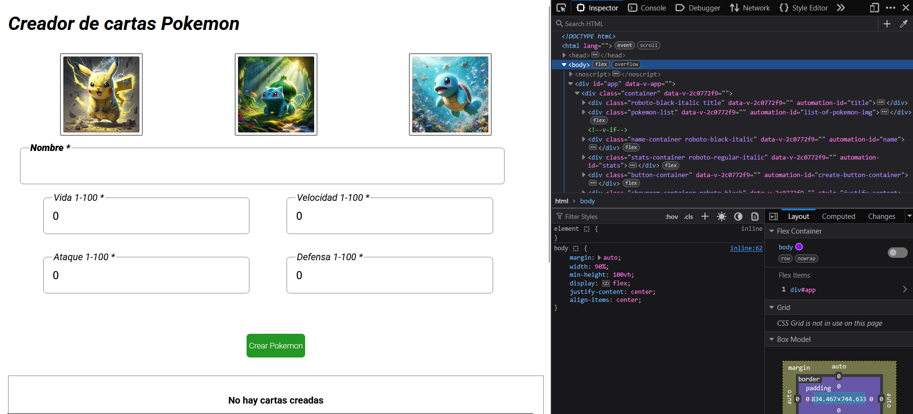

# Comencemos con los Tests

Si corremos la aplicación y nos dirigimos a http://localhost:8080 y abrimos la consola de inspección, con boton derecho sobre la pagina y vamos a inspect o inspeccionar dependiendo 



Con nuestro primer script navegamos al buscador y checkeamos que el titulo este bien escrito utilizando el automation id.


```python

```